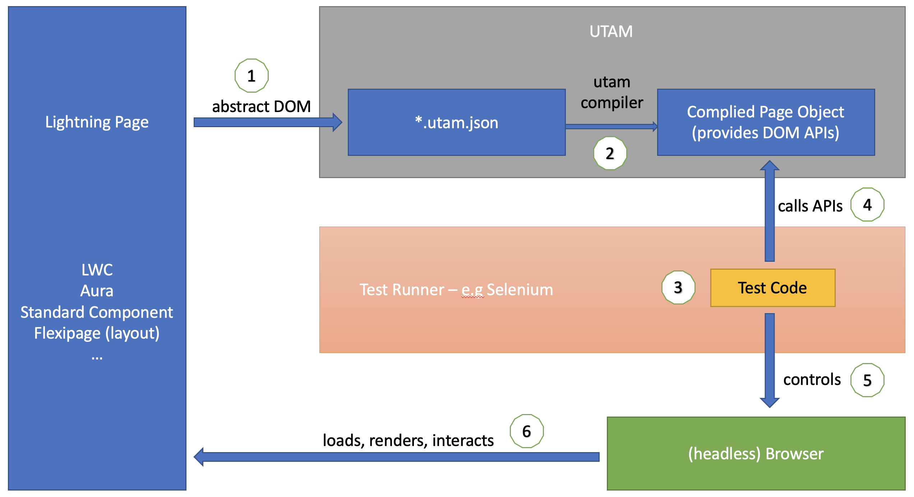

# Salesforce End-to-End Automation Testing

## UTAM - UI Test Automation Model

- UTAM is selected to test ANZx Salesforce practice, more documentation can be found [here](https://utam.dev)

- UTAM Flow

   

## Project Structure

```txt
├── automation-test
    ├── build
    └── src
        ├── common
        ├── data
        ├── pageObjects
        ├── tests
        ├── utam
        |   ├── auth
        |   ├── base
        |   └── lwc
        └── utils

```

- `build` folder manages the complied code. Test runner will pickup code in this folder for running tests.

- `src` folder contains the source code.

- `common` folder contains specific interaction scnearios used in test spec files. Some of these scenario can be reused in different test spec files.

- `data` folder manages test data.

- `tests` folder contains the test spec files and test running will look for those files for testing.

- `utam` folder will be the place to maintain \*.utam.json and utam compiler will compile these files into page objects in pageObjects folder (git ignored).

- `utils` folder groups reusable methods.

## Prerequisites

**Note: To install the NPM packages on the ANZ network, proxy settings need to be configured. The below articles can assist you with this. The top article also handles the setup of Salesforce.**

- [Salesforce Setup (Initial Proxy Setup)](https://confluence.service.anz/display/ABT/How+to+get+setup+your+laptop+for+Salesforce+development)

- [NPM Proxy setup](https://confluence.service.anz/display/~yero/NPM+Proxy+Setting)

### chromedriver

- install chromedriver

  ```bash
  npm install -g chromedriver --detect_chromedriver_version
  ```

  `OR`, if above command does not work, follow below:

- Download Mac chromedriver from this [website](https://sites.google.com/chromium.org/driver/downloads). Ensure that the driver you downloaded is for the chrome version you have installed on your computer. If the driver and chrome version does not match the automation will fail.

- Run below command to install the downloaded zip. Change the path in the command if needed.

  ```bash
  npm install -g chromedriver --chromedriver_filepath=/Path/Downloads/chromedriver_mac64.zip
  ```

### yarn

- install yarn if haven't done yet. See [here](https://classic.yarnpkg.com/lang/en/docs/install/#mac-stable)

  ```bash
  npm install --global yarn
  ```

### .env file

- The ANZ Salesforce End-to-End testing will test different business and feature scenarios with different user roles.

- Before running the test locally, create a .env file under journeytest folder with following entries so the test script can login into the test environment with correct credentials.

- Please update `./src/common/Auth.ts` and below sample with any missing test user credential env variables while contributing.

  ```txt
  SALESFORCE_LOGIN_URL=https://test.salesforce.com
  SALESFORCE_ENV_BASE=
  COACH_USERNAME=
  COACH_PASSWORD=
  ```

- **`For now engineers need to get test users' credentials and store in .env file. Please be mindful and DO NOT commit these credentials. This practice will be replaced in the future once the security store integration for automation is ready`**

- In .env file, the `SALESFORCE_ENV_BASE` variable is used to control in which org the test will be running. For now the only supported value is `test` as we will run the automation in test sandbox first.

- The `SALESFORCE_ENV_BASE` is also used to format the testing users' username at runtime. For exmaple: if `COACH_USERNAME` is `testusername@anzx.com`, the automation auth process will concatenate `COACH_USERNAME` + `'.'` + `SALESFORCE_ENV_BASE` and format the username to `testusername@anzx.com.test`.

## Run in Local

**`Make sure steps in Prerequisites have been followed`**

1. Switch to jorneytest folder if you are not in

   ```bash
   cd journeytest
   ```

2. Turn off ANZ VPN

3. Install dependencies

   ```bash
   npm install
   ```

4. Change wdio.conf.js, “goog:chromeoptions” and comment headless from the argument list, leave other arguments as is

   ```txt
   "goog:chromeOptions": {
    args: [
      // "--headless"
    ]
   }
   ```

5. Build locally

   ```bash
   npm run build
   ```

6. (optional) Rebuild and update pageObjects files if any \*.utam.json files have been edited

   ```bash
   npm run build:utam
   ```

7. (optional) Rebuild and update test code files if any \*.ts files have been edited

   ```bash
   npm run build:ts
   ```

   **note:** You can also use _watch_ mode of TS while coding so no need to rebuild everytime

   ```bash
   tsc -w
   ```

8. start chromedriver

   ```bash
   chromedriver
   ```

9. run test

   ```bash
   npm run test
   ```
