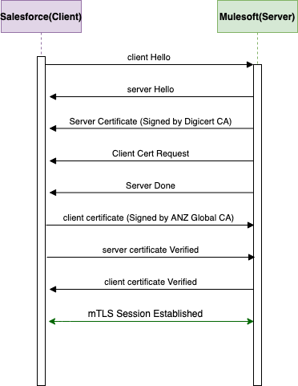
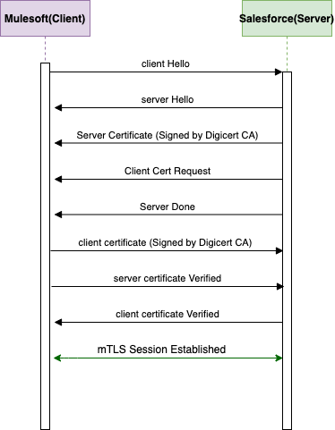

# **Certificates**

 - For salesforce integrations with mulesoft to work we need to do the following

 ##### For egress from Salesforce to Mulesoft

 

 1. From setup go to Certificate and Key Management.

 2. Click on Import from keystore in Certificate section and choose file found in misc folder in this repository(sfglobaltestks.jks) and in keystore password use **salesforce** 

 3. From setup go to Named Credentials and select edit Action on Mulesoft.

 4. In Authentication Section in Certificate choose sfglobaltestks.

 5. In JWT Signing Certificate from the dropdown choose sfglobaltestks.

### For Fabric Integrations from Salesforce 
If the salesforce org is configured for SSO such as Systest and Staging no additional steps are required. However if you want a scratch org or sandbox with no SSO integration.
1. In the named credentials change the TokenUrl named credentials URL:  https://login.microsoftonline.com/7f0788f7-3634-419b-bf74-bbe48147830c/oauth2/v2.0/token , username e0bd1ebf-68d8-4862-b8c6-49e59931c9de Password will be provided by github codeowners.
2. In Custom Settings click on Manage for Non Production Settings and check SSO Not Configured and uncheck MockCallouts so we are integrating with real endpoints rather than Mocks.
3. As admin go to Apex classes and edit AzureTestRefreshToken and change the REFRESHTESTVALUE field to a real refresh token provided by github codeowners.

##### For ingress into Salesforce from Mulesoft

 
Yet to be documented waiting on salesforce [case-27120116](https://help.salesforce.com/mysuccesshub?id=supportCases&caseId=5003y00000t1dRJAAY) to enable mtls in scratch orgs using snapshots. 
