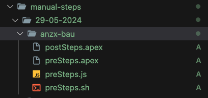

### Manual Steps

1. For each release, release engineer will create a folder inside `manual-steps` folder, with the name of the release. (eg: 29th May 2024 release: 29-05-2024). This will be done when we do master to develop after each release.

   \*\* Point: if epic engineers did merge the latest version of develop to their epic before release engineer create a new folder for manual steps, then epic engineers need to create a folder with same name.

2. Inside the release folder, for each epic there should be a folder by epic name ( eg: epic/anzx-bau : anzx-bau folder).

3. Inside the epic folder, we can have javascript, bash script, or apex files, with the hard-coded names:

   - `preSteps` for pre-deploy steps.
   - `postSteps` for post-depploy steps.

   \*\* example:
    
   

4. After each release, the release folder will be removed and a new folder for new release will be created and the pattern should be followed. ( Create release folder, then epic folders, and inside them `preSteps` or `postSteps` files.)

5. Salesforce Manual Steps Workflow is a manual workflow that you can run it manually against each sandbox that you want. There are some inputs that you need to pass to run this workflow:

   - `manual_step_name` :

     - description: "Pre/Post deploy step?"
     - required: true

   - `release_folder_name` :

     - description: "Which release manual steps folder?"
     - required: true

   - `exclude_epic_folders` :

     - description: "Manual steps folder to be excluded?"
     - required: false

     - Point: this can be some folders together with comma splited. ( eg: epic/anzx-bau, develop)

   - `from_which_epic` :

     - description: "Manual Steps from which epic?"
     - required: true

   - `to_which_epic` :
     - description: "Manual steps to be done on which epic?"
     - required: true

- This is just for non-prod sandboxes.
